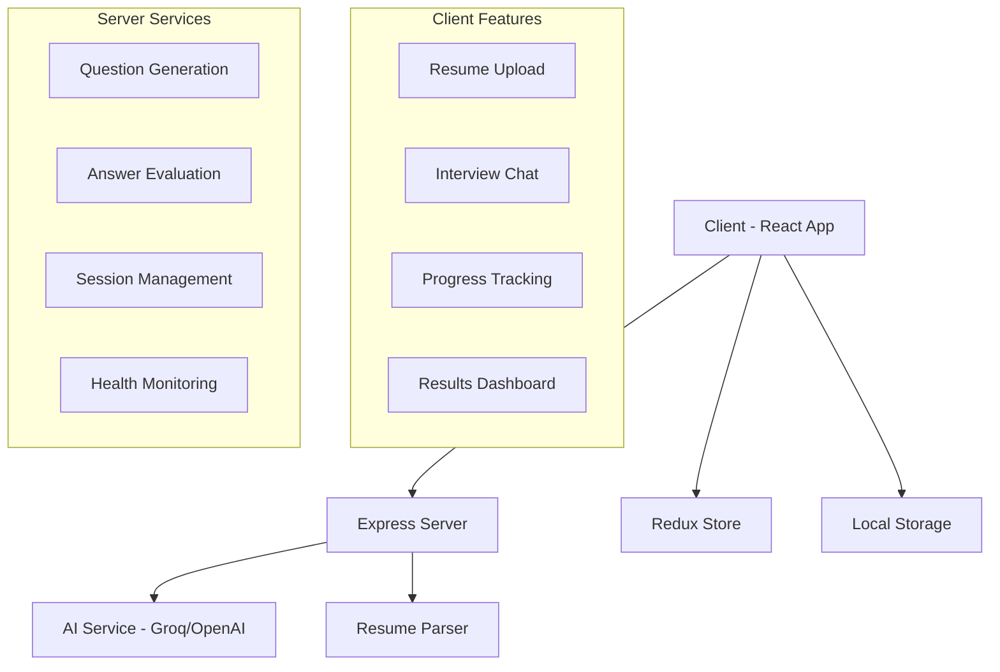

# 🚀 InterVue AI - Next-Generation Interview Platform

<div align="center">


**An intelligent, AI-powered interview platform that revolutionizes the hiring process**

[](https://reactjs.org/)
[](https://nodejs.org/)
[](https://openai.com/)
[](LICENSE)

</div>

## 📋 Table of Contents

- [✨ Features](#-features)
- [🎯 What Makes InterVue AI Special](#-what-makes-intervue-ai-special)
- [🏗️ Architecture](#️-architecture)
- [🚀 Quick Start](#-quick-start)
- [📁 Project Structure](#-project-structure)
- [🛠️ Technologies Used](#️-technologies-used)
- [⚙️ Configuration](#️-configuration)
- [📖 API Documentation](#-api-documentation)
- [🎨 UI/UX Highlights](#-uiux-highlights)
- [🤝 Contributing](#-contributing)
- [📄 License](#-license)

## ✨ Features

### 🧠 AI-Powered Intelligence
- **Smart Resume Parsing**: Automatically extracts candidate information from PDF/DOCX files
- **Dynamic Question Generation**: Creates personalized interview questions based on candidate profile
- **Intelligent Scoring**: AI-driven evaluation and feedback system
- **Real-time Analysis**: Live conversation analysis and insights

### 👥 Dual Interface Design
- **Interviewee Portal**: Clean, stress-free interview experience
- **Interviewer Dashboard**: Comprehensive management and analytics tools

### 📄 Advanced Resume Processing
- **Multi-format Support**: PDF and DOCX compatibility
- **Skill Detection**: Automatic identification of technical skills
- **Experience Analysis**: Smart parsing of work history and qualifications
- **Data Validation**: Ensures accuracy and completeness

### 💬 Interactive Interview System
- **Real-time Chat**: Seamless conversation flow
- **Question Progression**: Structured interview process
- **Answer Evaluation**: Instant feedback and scoring
- **Session Management**: Save and resume interviews

### 🎨 Modern User Experience
- **Professional Design**: Clean, modern interface with gradient themes
- **Responsive Layout**: Perfect on desktop, tablet, and mobile
- **Smooth Animations**: Engaging micro-interactions and transitions
- **Accessibility**: Built with accessibility best practices

## 🎯 What Makes InterVue AI Special

### 🔮 Intelligent Question Generation
InterVue AI doesn't just ask generic questions. It analyzes your resume and creates tailored questions that match your:
- **Technical Skills**: Questions specific to your technology stack
- **Experience Level**: Appropriate difficulty based on your background
- **Industry Focus**: Relevant scenarios for your field
- **Career Goals**: Aligned with your professional objectives

### 🎪 Immersive Interview Experience
- **Stress-Free Environment**: Comfortable, non-intimidating interface
- **Progressive Difficulty**: Questions that adapt to your responses
- **Real-time Feedback**: Immediate insights into your performance
- **Practice Mode**: Safe space to improve interview skills

### 📊 Comprehensive Analytics
- **Performance Metrics**: Detailed scoring and analytics
- **Skill Assessment**: Strengths and improvement areas
- **Interview History**: Track progress over time
- **Comparative Analysis**: Benchmark against industry standards

## 🏗️ Architecture



## 🚀 Quick Start

### Prerequisites
- **Node.js** (v16 or higher)
- **npm** or **yarn**
- **AI API Key** (Groq or OpenAI)

### Installation

1. **Clone the repository**
   ```bash
   git clone https://github.com/yourusername/InterVueAI.git
   cd InterVueAI
   ```

2. **Install dependencies**
   ```bash
   # Install server dependencies
   cd server
   npm install
   
   # Install client dependencies
   cd ../client
   npm install
   ```

3. **Environment Configuration**
   
   Create `.env` files in both `server` and `client` directories:
   
   **Server `.env`:**
   ```env
   GROQ_API_KEY=your_groq_api_key_here
   PORT=8000
   NODE_ENV=development
   ```
   
   **Client `.env`:**
   ```env
   VITE_API_URL=http://localhost:8000/api
   ```

4. **Start the application**
   ```bash
   # Terminal 1 - Start server
   cd server
   npm start
   
   # Terminal 2 - Start client
   cd client
   npm run dev
   ```

5. **Access the application**
   - Open your browser and navigate to `http://localhost:5173`
   - The server runs on `http://localhost:8000`

## 📁 Project Structure

```
InterVueAI/
├── 📁 client/                    # React frontend application
│   ├── 📁 src/
│   │   ├── 📁 components/        # Reusable UI components
│   │   │   ├── ResumeUploader.jsx    # Resume upload & parsing
│   │   │   ├── ChatWindow.jsx        # Interview chat interface
│   │   │   ├── WelcomeBackModal.jsx  # Session resume modal
│   │   │   └── Timer.jsx             # Interview timer
│   │   ├── 📁 pages/             # Main application pages
│   │   │   ├── Interviewee.jsx       # Candidate interface
│   │   │   └── Interviewer.jsx       # HR dashboard
│   │   ├── 📁 redux/             # State management
│   │   │   ├── store.js              # Redux store configuration
│   │   │   ├── candidateSlice.js     # Candidate data management
│   │   │   └── interviewSlice.js     # Interview session management
│   │   ├── 📁 api/               # API integration
│   │   │   └── aiService.js          # AI service calls
│   │   ├── 📁 utils/             # Utility functions
│   │   │   └── resumeParser.js       # Resume parsing logic
│   │   ├── App.jsx               # Main application component
│   │   ├── main.jsx              # Application entry point
│   │   └── index.css             # Global styles & animations
│   ├── package.json              # Dependencies & scripts
│   └── vite.config.js            # Vite configuration
│
├── 📁 server/                    # Node.js backend server
│   ├── index.js                  # Express server & API routes
│   ├── package.json              # Server dependencies
│   └── .env                      # Environment variables
│
└── README.md                     # Project documentation
```

## 🛠️ Technologies Used

### Frontend Stack
- **⚛️ React 18.3.1** - Modern UI library with hooks
- **🎨 Ant Design 5.27.4** - Professional UI components
- **🗄️ Redux Toolkit** - Predictable state management
- **🎯 Tailwind CSS** - Utility-first styling
- **📱 Vite** - Fast build tool and dev server
- **📄 PDF-Parse** - PDF document processing
- **📝 Mammoth.js** - DOCX document parsing

### Backend Stack
- **🟢 Node.js** - JavaScript runtime
- **🚀 Express.js** - Fast web framework
- **🤖 Groq AI** - Advanced language model
- **🌐 Axios** - HTTP client library
- **🔄 CORS** - Cross-origin resource sharing
- **⚙️ dotenv** - Environment variable management

### Development Tools
- **📦 ESLint** - Code linting and formatting
- **🔧 Nodemon** - Auto-restart development server
- **🎨 PostCSS** - CSS processing
- **📱 Responsive Design** - Mobile-first approach

## ⚙️ Configuration

### AI Service Configuration
The application supports multiple AI providers:

```javascript
// Default: Groq (Fast & Cost-effective)
const GROQ_API_URL = "https://api.groq.com/openai/v1/chat/completions";

// Alternative: OpenAI (High Quality)
// const OPENAI_API_URL = "https://api.openai.com/v1/chat/completions";
```

### Customization Options
- **Question Difficulty**: Adjust easy/medium/hard ratios
- **Evaluation Criteria**: Customize scoring algorithms
- **UI Themes**: Modify color schemes and animations
- **Session Duration**: Configure interview time limits

## 📖 API Documentation

### Endpoints

#### Health Check
```http
GET /api/health
```
**Response:** `200 OK`

#### Generate Interview Questions
```http
POST /api/generate-questions
Content-Type: application/json

{
  "role": "Frontend Developer",
  "skills": ["React", "JavaScript", "CSS"],
  "experience": "3 years"
}
```

**Response:**
```json
{
  "questions": [
    {
      "question": "Explain the concept of Virtual DOM in React",
      "difficulty": "medium",
      "correctAnswer": "Virtual DOM is a programming concept..."
    }
  ]
}
```

#### Evaluate Answer
```http
POST /api/evaluate-answer
Content-Type: application/json

{
  "question": "Question text",
  "answer": "Candidate's answer",
  "expectedAnswer": "Model answer"
}
```

## 🎨 UI/UX Highlights

### Design Philosophy
- **🎯 User-Centric**: Designed from the candidate's perspective
- **🧘 Stress-Free**: Calming colors and smooth animations
- **📱 Responsive**: Perfect experience across all devices
- **♿ Accessible**: WCAG 2.1 AA compliance

### Visual Features
- **🌈 Gradient Themes**: Modern blue-to-purple color schemes
- **✨ Micro-interactions**: Engaging hover effects and transitions
- **🔍 Glass Morphism**: Contemporary backdrop blur effects
- **📊 Progress Indicators**: Clear visual feedback on interview progress

### Animation System
```css
/* Custom animations for enhanced UX */
@keyframes slideInUp { /* Smooth entry animations */ }
@keyframes float { /* Subtle floating effects */ }
@keyframes glow { /* Interactive element highlighting */ }
```

## 🤝 Contributing

We welcome contributions! Here's how you can help:

### Getting Started
1. **Fork** the repository
2. **Create** a feature branch (`git checkout -b feature/AmazingFeature`)
3. **Commit** your changes (`git commit -m 'Add some AmazingFeature'`)
4. **Push** to the branch (`git push origin feature/AmazingFeature`)
5. **Open** a Pull Request

### Contribution Guidelines
- 📝 Follow existing code style and conventions
- ✅ Add tests for new features
- 📖 Update documentation as needed
- 🔍 Ensure all tests pass before submitting

### Areas for Contribution
- 🤖 AI prompt engineering and optimization
- 🎨 UI/UX improvements and new themes
- 📊 Analytics and reporting features
- 🌐 Internationalization (i18n)
- 🔧 Performance optimizations
- 📱 Mobile app development

## 🐛 Issues & Support

### Reporting Issues
- 🔍 Check existing issues before creating new ones
- 📝 Provide detailed reproduction steps
- 🖼️ Include screenshots for UI issues
- 🏷️ Use appropriate labels and templates

### Getting Help
- 📖 Check the documentation first
- 💬 Join our community discussions
- 📧 Contact the maintainers
- 🎯 Follow our troubleshooting guide

## 📈 Roadmap

### Upcoming Features
- 🎥 **Video Interviews**: WebRTC-based video calling
- 📊 **Advanced Analytics**: Detailed performance insights
- 🌐 **Multi-language Support**: Global accessibility
- 🔐 **Enterprise Features**: SSO, advanced security
- 📱 **Mobile Apps**: Native iOS and Android apps
- 🤖 **AI Improvements**: Better question generation

### Long-term Vision
- 🎯 Industry-specific interview modules
- 🔄 Integration with popular ATS systems
- 📚 Interview preparation courses
- 🏆 Certification and skill validation
- 🌍 Global talent marketplace

## 📄 License

This project is licensed under the **MIT License** - see the [LICENSE](LICENSE) file for details.

---

<div align="center">

**Made with ❤️ by the InterVue AI Team**

[🌟 Star this repo](https://github.com/yourusername/InterVueAI) • [🐛 Report Bug](https://github.com/yourusername/InterVueAI/issues) • [✨ Request Feature](https://github.com/yourusername/InterVueAI/issues)

---

*InterVue AI - Transforming interviews, one conversation at a time* 🚀

</div>